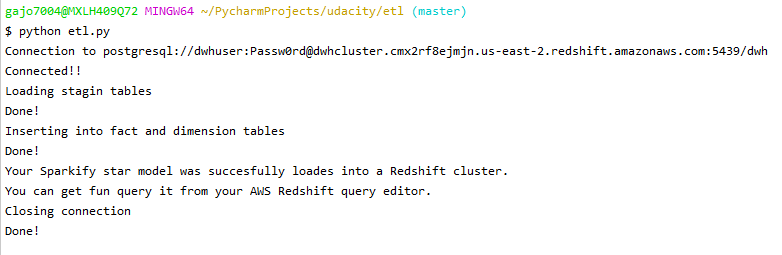

# Sparkify -  Data model

This is a pipeline whose main purpose is to get insights about Sparkify application usage. 
Next, the 3 questions/queries that this project answers: 
    
    - Give me the artist, song title and song's length in the music app history that was heard during sessionId = 338, and itemInSession = 4
    - Give me only the following: name of artist, song (sorted by itemInSession) and user (first and last name) for userid = 10, sessionid = 182
    - Give me every user name (first and last) in my music app history who listened to the song 'All Hands Against His Own'
    
All tables were designed based on the needs of analytics team. 

## Getting Started

### Prerequisites

    - An Amazon Web Services account (Key and Secret key are requiered to set up the a cluster).
    - Python 3
    
    Next, the recommended Redshift configurations
        - DWH_CLUSTER_TYPE			multi-node
        - DWH_NUM_NODES				4
        - DWH_NODE_TYPE				dc2.large     

### Running 

For creating a Redshift cluster, follow the next steps:

1. Set in ./cluster/cfg file the following attributes

    - KEY *
    - SECRET *
    - DWH_CLUSTER_IDENTIFIER
    - DWH_DB				
    - DWH_DB_USER			
    - DWH_DB_PASSWORD		
    - DWH_PORT				
    - DWH_IAM_ROLE_NAME						
    
    * Get this credentials from your AWS account. Don´t share and keep them save.

2. In a terminal go to cluster folder and execute:
    `python -c 'from cluster import *; create_cluster()'`  
    
    This command will create a AWS cluster with the settings of cluster/dwh.cfg file
    
    

3. Execute:
    `python -c 'from cluster import *; cluster_status()'`
    
    The current cluster status will appear in the console. 
    
    
    
4. When the cluster status is Available, execute
    `python -c 'from cluster import *; create_vpc()'`
    
    It will configure a Virtual Private Cloud which allows 
    connections from any IP to our cluster in the port $DWH_PORT
    
    
5. Execute 
    `python -c 'from cluster import *; show_cluster_info()'`
        
    This command will show the required cluster endpoint and ARN Role
    we need to get a connection to out Redshift cluster.             
    
    
   
6. Go to the setup folder and execute 

    `python create_table.py`
    
    It will create the schema, staging and star tables      
    
         

7. Open a terminal, and go to etl folder and execute the following command:
    
    `python etl.py`
    
You will see an output like this:

The output contains:

    - Connection status
    - Staging tables load status
    - Fact and dimension load status
    - Closing resources message
        
## ##########################################

    
## Data base design    

**staging_events**: It is used to directly load log data from s3://udacity-dend/log_data bucket 

**staging_songs**: Staging table where we load data from s3://udacity-dend/song_data 

**songplays**: It is used as a fact table. It has a distribution strategy **KEY**

**users**: Table dimension for user's info. It has a **sortkey** for user_id. Distribution strategy: **all**

**songs**: Dimension table for song's data. **Sortkey** in year colunm. Distribution strategy: **KEY**, because data volume  

**artists**: Dimension table which contains artist information. Sortkey in artist_id column. Distribution strategy: **all** 

**time**: Dimension table for time purposes. **Sortkey** in start_time column. Distribution strategy: **all**

## Files description

**cluster/cluster.py**: Script to create a Redshift cluster

**cluster/dwh.cfg**: It contains properties needed to create a cluster

**etl/sql_queries.py**: Contains all the required queries to load staging and star schema tables

**etl/etl.py**: It contains the ETL process. It has a main method who invokes different function to get the job done.

**setup/sql_queries.py**: Contains all the required queries to create staging, fact and dimension tables

**setup/create_table.py**: It creates schema, staging, fact and dimension tables 

**etl/resources/*.***: Images used in documentation

When the work is done, go to cluster folder and execute `python -c 'from cluster import *; delete_cluster()'` to delete Redshift cluster and avoid unexpected charges.
